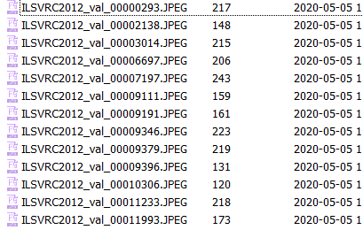

# Python

A PyTorch implementation of universal adversarial perturbation which is more easy to understand and implement. <br>Refer to the original [*tensorflow code*](https://github.com/LTS4/universal). <br>


## Usage

### Dataset
[training dataset(Choose 10 imgs for each category)](http://www.image-net.org/challenges/LSVRC/2012/dd31405981ef5f776aa17412e1f0c112/ILSVRC2012_img_train.tar)<br>
[Validation dataset](http://www.image-net.org/challenges/LSVRC/2012/dd31405981ef5f776aa17412e1f0c112/ILSVRC2012_img_val.tar)<br>

All you need to do is unzip the downloaded file, and the results are as follows:




### Get started

To get started, you should first Change the training data file path (in `search.py`) to yours. For example
```python
X = ImagetNet('../data/ILSVRC2012_train/pick_image/', 1000, 10, transforms = transform)
```
If your testing data path (in `search.py`) is `testing_data_path`, then you should write
```python
val_loader = torch.utils.data.DataLoader(ImageFolder(testing_data_path, transforms = transform)
```
It should be noted that I use two different ways to input our data (i.e., X and val_loader), the main reason I didn't make it consistent is because I wanted to show you a variety of ways to write it. Hope it doesn't bother you.

After you modify all the path, then you can run the following demo code
```
python search.py
```

### Result

I tested our code for `googlenet` , and with `epsilon=10` (`L_\inf`), our accuracy on the validation set was ~78%.  It is similar with the result report in paper.


## Reference

[1] S. Moosavi-Dezfooli\*, A. Fawzi\*, O. Fawzi, P. Frossard:
[*Universal adversarial perturbations*](http://arxiv.org/pdf/1610.08401), CVPR 2017

